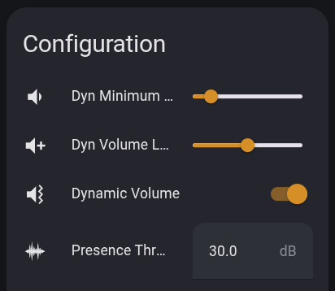
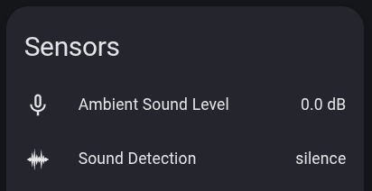

<a name="readme-top"></a>
[](#) [](https://github.com/fixtse)

<a href='https://ko-fi.com/M4M6P9A5P' target='_blank'></a>

# Home Assistant Voice SoundSense

## Table of Contents
- [Features](#features)
- [Installation](#installation)
  - [Method 1: Using ESPHome Packages](#method-1-using-esphome-packages-recommended)
  - [Method 2: Manual Installation](#method-2-manual-installation)
- [Technical Details](#technical-details)

## Features

<div align="center">
  <table>
    <tr>
      <td></td>
      <td></td>
    </tr>
  </table>
</div>

The SoundSense package extends the Dynamic Volume Capabilities with Sound detection features.
The system is designed to be resource-efficient and responsive, providing a natural listening experience by keeping your device's volume at an optimal level for the current environment.

### Sound Detection States

SoundSense analyzes the ambient sound and classifies it into five different states:

- **Silence**: Prolonged period (>15s) of very low ambient noise
- **Quieting**: Recent transition to low ambient noise
- **Active**: Normal ambient sound activity
- **Noise**: Sudden spikes in sound levels
- **Presence**: Sustained elevated sound levels, indicating ongoing activity or presence

### Configurable Controls

SoundSense provides three configurable controls:

1. **Dynamic Minimum Volume** (0-100%): Sets the base volume level when ambient noise is minimal
2. **Dynamic Volume Level** (0-10): Controls how aggressively volume scales up with ambient noise
3. **Presence Threshold** (0-100 dB): Sets the sound level that triggers "presence" detection

### Optimized Sound Processing

- **Real-time audio processing** using microphone `on_data` triggers for maximum efficiency
- **Efficient sound level calculation** using logarithmic dB conversion
- **Smart hysteresis** to prevent rapid volume fluctuations
- Volume adjustments occur **only when necessary**, with smooth transitions
- Processing **pauses during media playback** to avoid feedback loops
- **Microphone trigger approach** processes audio data as it arrives rather than polling

<p align="right">(<a href="#readme-top">back to top</a>)</p>

## Installation

### Method 1: Using ESPHome Packages (Recommended)

If you want to use the SoundSense package, add the following to your configuration:

```yaml
packages:
  SoundSense: github://fixtse/ha-voice-sound-sense/sound_sense.yaml
```

Then you need to add the microphone trigger to call the sound processing script. Add this to your microphone configuration:

```yaml
microphone:
  - platform: i2s_audio  # or your microphone platform
    id: i2s_mics
    # ... your existing microphone config ...
    on_data:
      - script.execute:
          id: process_audio_data
          audio_data: !lambda return x;
```

Example integration with your existing configuration:

```yaml
substitutions:
  name: your-ha-voice-device-name  # Replace with your device name
  friendly_name: Your HA Voice     # Replace with your friendly name

packages:
  # Official ESPHome Home Assistant Voice PE package
  Voice PE: github://esphome/home-assistant-voice-pe/home-assistant-voice.yaml
  # SoundSense package
  SoundSense: github://fixtse/ha-voice-sound-sense/sound_sense.yaml

# Your existing API configuration
api:
  encryption:
    key: YOUR_API_KEY

# Your existing WiFi configuration  
wifi:
  ssid: !secret wifi_ssid
  password: !secret wifi_password

# Add microphone trigger for sound processing
microphone:
  - platform: i2s_audio
    id: i2s_mics
    # ... your existing microphone configuration ...
    on_data:
      - script.execute:
          id: process_audio_data
          audio_data: !lambda return x;
```

### Method 2: Manual Installation

If you prefer not to use packages, you can copy the full configuration from the [sound_sense.yaml](sound_sense.yaml) file and add it to your existing ESPHome configuration.

**Important**: You must also add the microphone trigger to your microphone configuration:

```yaml
microphone:
  - platform: i2s_audio  # or your microphone platform
    # ... your existing microphone config ...
    on_data:
      - script.execute:
          id: process_audio_data
          audio_data: !lambda return x;
```

<p align="right">(<a href="#readme-top">back to top</a>)</p>

## Technical Details

SoundSense uses an advanced algorithm to:

1. **Trigger on audio data**: Uses ESPHome's `microphone.on_data` trigger for real-time processing
2. **Calculate sound levels**: Convert audio samples to decibel measurements using logarithmic lookup
3. **State detection**: Apply logic based on configurable thresholds for presence detection
4. **Dynamic volume**: Calculate volume adjustments based on ambient conditions
5. **Smooth transitions**: Apply hysteresis and smoothing for stable volume changes

<p align="right">(<a href="#readme-top">back to top</a>)</p>

## Troubleshooting

### Common Issues

**Q: The Ambient Sound Level sensor shows 0 or doesn't update**
- Ensure you've added the `on_data` trigger to your microphone configuration
- Verify the microphone is working in ESPHome logs

**Q: Dynamic volume isn't working**
- Make sure the Dynamic Volume switch is turned on in Home Assistant


**Q: Sound detection states don't change**
- Ensure the microphone is picking up audio (check Ambient Sound Level sensor)
- Adjust the Presence Threshold setting in Home Assistant


<p align="right">(<a href="#readme-top">back to top</a>)</p>

## License

Shield: [![CC BY-NC-SA 4.0][cc-by-nc-sa-shield]][cc-by-nc-sa]

This work is licensed under a
[Creative Commons Attribution-NonCommercial-ShareAlike 4.0 International License][cc-by-nc-sa].

[![CC BY-NC-SA 4.0][cc-by-nc-sa-image]][cc-by-nc-sa]

[cc-by-nc-sa]: http://creativecommons.org/licenses/by-nc-sa/4.0/
[cc-by-nc-sa-image]: https://licensebuttons.net/l/by-nc-sa/4.0/88x31.png
[cc-by-nc-sa-shield]: https://img.shields.io/badge/License-CC%20BY--NC--SA%204.0-lightgrey.svg

<p align="right">(<a href="#readme-top">back to top</a>)</p>
